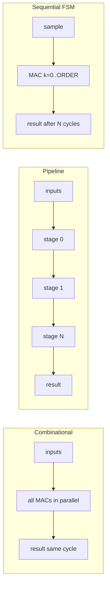
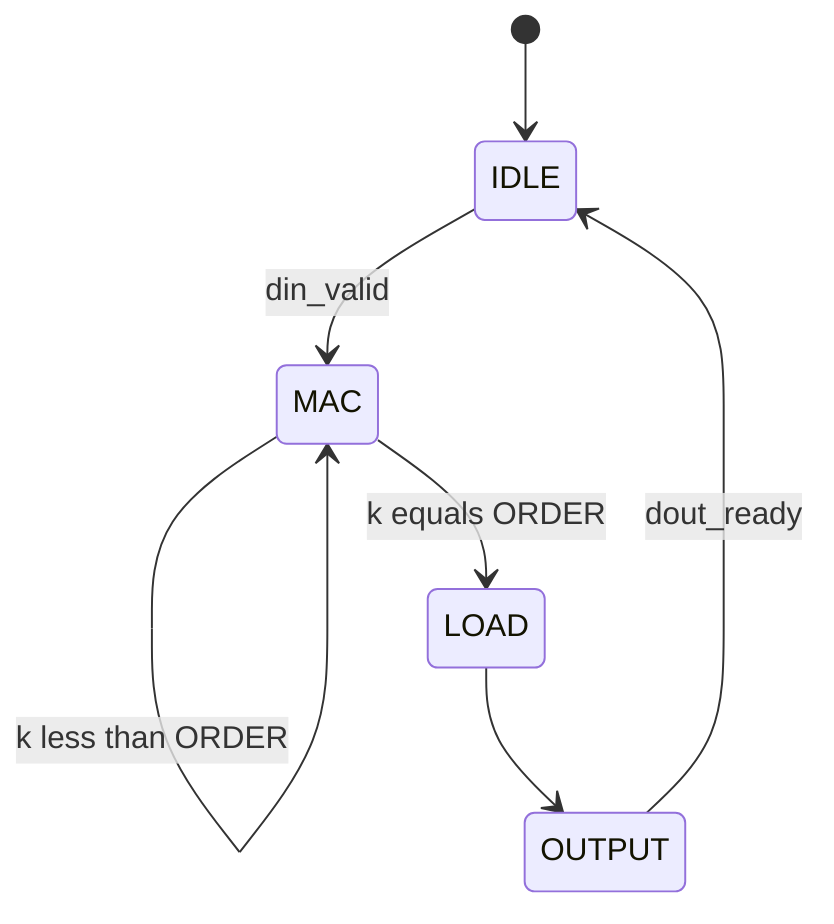

# Combinational, pipeline, and sequential — choosing a VHDL style

How to implement the **datapath** between `DATA_IN` and `DATA_OUT` in your AXI slave.

This guide explains **what happens cycle by cycle**, **what problem each style solves**, and **which one to pick** for FIR, convolution, or unknown exam topics.

Lab reference: **labo8** (`fir_filter__cmb.vhd`, `fir_filter__pip.vhd`, `fir_filter__seq.vhd`).

---

## The question you are answering

Software does `write(DATA_IN)` and `read(DATA_OUT)`. Inside the FPGA you must:

1. **Store** past inputs if the algorithm needs history (FIR delay line, conv line buffer).
2. **Compute** products and sums (MAC).
3. **Expose** the result when ready (status bit, IRQ, or valid signal).

The three styles differ in **where registers sit** between those steps — not in the math itself.

---

## Quick comparison

| Style | What is registered | Latency | Throughput | Exam fit |
|-------|-------------------|---------|------------|----------|
| **Combinational** | Inputs/history only; MAC is pure logic | ~0–1 clk | 1 sample/clk possible | 3-tap FIR, 3×3 conv |
| **Pipeline** | Every MAC stage | N stages fixed | 1 sample/clk steady state | Fast stream, large ORDER |
| **Sequential (FSM)** | Acc + counter; **one** MAC step/cycle | ORDER+ cycles | 1 sample every N cycles | Huge ORDER, small area |



---

## 1. Combinational (labo8 `fir_filter__cmb`, labo9 `conv_engine`)

### What “combinational” means here

The multiply-add tree has **no flip-flops inside**. On each clock where inputs are valid, `x_reg` updates; the sum wires **immediately** reflect the new `x_reg` and coeffs. You may register the **output** for timing, but all taps are computed in parallel in the same cycle.

### Cycle-by-cycle (3-tap FIR example)

| Cycle | Event | Hardware |
|-------|-------|----------|
| n | `DATA_IN` write, byte `x=5` | Shift reg: `[5, x1, x2]` |
| n | same cycle (comb) | `y = C0*5 + C1*x1 + C2*x2` computed |
| n or n+1 | software `read DATA_OUT` | Returns `y` |

### Structure

```
        ┌─── x[0] * c[0] ───┐
din ──► │ shift reg         ├──► Σ ──► dout
        └─── x[N] * c[N] ───┘
              ▲
           clock only here
```

### Reference code — what each part does

```vhdl
-- Clocked: shift input history
process (rst_i, clk_i) ... end process;
```

**Role:** Only job is remembering past samples. Runs once per new input.

```vhdl
-- Combinational: full MAC
process (x_reg, coeffs_i)
    variable acc : signed(ACC_W - 1 downto 0);
begin
    acc := (others => '0');
    for k in 0 to ORDER loop
        acc := acc + resize(x_reg(k) * coeffs_i(k), ACC_W);
    end loop;
    dout_o <= std_logic_vector(resize(acc, DATASIZE));
end process;
```

**Role:** `for k in 0 to ORDER` builds parallel multipliers in silicon. `variable acc` is not a register — it is scratch space for the synthesised adder tree.

```vhdl
dout_valid_o <= din_valid_i;   -- or register both for timing
```

**Role:** Tells downstream “result matches this input.” Register both sides if timing closure needs it.

### When combinational is the right choice

| Situation | Why comb works |
|-----------|----------------|
| **TE2 2024 FIR** (3 coeffs) | 3 multipliers + 2 adders — trivial at 50 MHz |
| **3×3 convolution** | 9 products — labo9 `conv_engine` uses this |
| **Exam time &lt; 2 h for PL** | Least control logic; fewer FSM bugs |
| Software polls slowly | Throughput not limited by FPGA anyway |

### When **not** to use

- `ORDER > 16` or very wide data — critical path may break 50 MHz.
- Subject demands explicit pipeline stages for marks.

### Trade-offs

| Advantage | Disadvantage |
|-----------|--------------|
| Fastest to write and simulate | Long path limits max frequency |
| Easy to test: change input → see output | Area grows with ORDER |
| Matches 2024 exam scale | Does not scale to labo8 ORDER=64 without seq/pipe |

---

## 2. Pipeline (labo8 `fir_filter__pip`)

### What “pipeline” means

The MAC is **cut into stages**. Each stage registers its result on the clock edge. Throughput can be **one sample per clock** after the pipe fills, but the **first** result appears only after `N` cycles (pipeline latency).

### Cycle-by-cycle (simplified 4-tap mental model)

| Cycle | Stage 0 | Stage 1 | Stage 2 | Output valid |
|-------|---------|---------|---------|--------------|
| 1 | x0*c0 | — | — | no |
| 2 | x1*c1 | acc partial | — | no |
| 3 | x2*c2 | acc partial | acc partial | no |
| 4 | x3*c3 | … | final sum | **yes** |
| 5+ | one tap/clk | … | one result/clk | steady stream |

### Structure

```
din ─► [×c0] ─► [+acc0] ─► [×c1] ─► [+acc1] ─► ... ─► dout
        reg      reg       reg      reg
```

### What labo8 signals do

| Signal | Purpose |
|--------|---------|
| `prod_pipe` | Registered products per tap stage |
| `acc_pipe` | Running partial sums between stages |
| `valid_pipe` | Shift register tracking “bubble” vs valid data in pipe |
| `din_ready_o <= '1'` | Always ready in labo8 simplification; real designs gate this |

**`valid_pipe`:** When you insert a new sample at stage 0, you also shift a `'1'` down the valid chain so the output block knows when the accumulated value is real vs reset garbage.

### When pipeline is useful

- Continuous stream: audio samples, pixel rows, DMA feeding FIFO every clock.
- Large `ORDER` but you still need **one output per clock** after startup.
- Course lab explicitly grades pipeline implementation (labo8 part 2).

### When to skip in the exam

- 3-tap FIR + `read`/`write` from userspace — pipeline adds complexity with no benefit.
- You have not simulated `fir_filter__pip` before — **comb is safer**.

### Trade-offs

| Advantage | Disadvantage |
|-----------|--------------|
| High Fmax + high throughput | Many registers; easy to get `valid` wrong |
| Fixed latency once filled | Harder to debug than comb |
| Scales to larger ORDER | Longer to write under time pressure |

---

## 3. Sequential FSM (labo8 `fir_filter__seq`)

### What “sequential” means

**One** multiplier and **one** accumulator. FSM loops `k = 0 .. ORDER`: each cycle does `acc += x_reg(k) * c(k)`. Result ready after `ORDER+1` MAC cycles per sample.

### State machine — what each state does



| State | Action | Why |
|-------|--------|-----|
| **IDLE** | Wait for `din_valid_i` | Only accept new sample when not busy |
| **MAC** | `acc_en`, increment `k` | One tap per clock |
| **LOAD** | Copy `acc_reg` to `dout_reg` | Isolate output from next MAC |
| **OUTPUT** | `dout_valid_o`, wait `dout_ready_i` | Handshake before next sample |

### Control signals (labo8) — when they fire

| Signal | When asserted | Effect |
|--------|---------------|--------|
| `shift_en` | Leaving IDLE with valid input | Push new sample into delay line |
| `acc_clear` | Start of MAC sequence | Zero accumulator |
| `acc_en` | Every cycle in MAC | Add one product |
| `k_inc` | MAC while k &lt; ORDER | Next tap |
| `dout_load` | LOAD state | Latch final sum to output reg |

`din_ready_o <= '1' when state = IDLE` — software/hardware must not send a new sample while FSM is busy.

### When sequential is useful

- **Resource constrained:** one shared DSP block instead of N parallel multipliers.
- **Very large ORDER** (labo8 default 8+).
- Low sample rate: HPS polls status between samples anyway.

### When sequential is a bad exam choice

- **2024 FIR (3 taps)** — FSM is 3× more code than comb for same behaviour.
- Tight deadline — FSM typos (`acc_en` stuck high, wrong `k_clear`) waste debug time.

### Trade-offs

| Advantage | Disadvantage |
|-----------|--------------|
| Smallest multiplier count | **Slow:** ORDER cycles per output |
| Teaches clear control/datapath split | More signals to get wrong |
| Good for huge filters | Poor fit for polled AXI if you forget `din_ready` |

---

## Mixed designs (real labo9 convolution)

Real systems **combine** styles:

| Block | Style | Why |
|-------|-------|-----|
| AXI write / FIFO fill | Sequential processes | Bytes arrive over many writes |
| Line buffers (3 rows) | Sequential shift | Must remember previous image rows |
| `conv_engine` 9 MACs | **Combinational** | Kernel fixed 3×3 |
| Output FIFO | Sequential pointers | Decouple conv speed from AXI read speed |

So “convolution exam” ≠ pick one style globally. Typical split: **seq buffers + comb MAC**.

---

## Mapping to exam topics

### FIR filter (2024 style)

Equation: `y = C0·x + C1·x1 + C2·x2`

**Recommended:** combinational MAC + shift register (guide 05 §6–7).

Hook-up in AXI slave:

1. Writes to `PARAM_0..2` → store `C0,C1,C2`.
2. Each `DATA_IN` write → shift delay line, comb block updates `y`.
3. `read DATA_OUT` → return `y`; optional IRQ when `y` valid.

| Style | Verdict for 2024 |
|-------|------------------|
| Combinational | **Use this** |
| Pipeline | Only if streaming many bytes back-to-back |
| Sequential FSM | Avoid unless ORDER ≫ 3 |

### Convolution 3×3 (labo9 style)

| Block | Style |
|-------|-------|
| MAC core | Combinational (`conv_engine`) |
| Row/column scan | Sequential line buffers |
| Input/output FIFOs | Sequential pointers + flags |

### Generic `template_generic`

In `when 6 =>` (`DATA_IN`):

- **Comb:** set `data_out_s` same cycle — good for FIR-like specs.
- **Seq:** set flag `start_mac`, FSM runs, set `ST_DONE` in status — good if exam says “processing takes several cycles”.

---

## Decision checklist (exam day)

Read the subject, then:

### 1. Count MAC operations

- **≤ 16 products** → start **combinational**.
- **> 16** → consider **sequential FSM** or **pipeline**.

### 2. How fast must data move?

- Userspace `write` … `read` in a loop (slow) → **combinational or sequential** both OK.
- “One sample per clock at 50 MHz” → **combinational or pipeline**.

### 3. What clock?

DE1 Qsys `clk_0` = **50 MHz**. Period = 20 ns. Comb 3-tap or 3×3 conv easily fits. Worry about timing only if ORDER is large or subject asks for high Fmax.

### 4. How much time left?

| Time left | Pick |
|-----------|------|
| &lt; 1 h for PL | Combinational + shift reg |
| Plenty + labo8 pip done | Pipeline if spec needs throughput |
| Huge ORDER in subject | Sequential FSM from `fir_filter__seq.vhd` |

### 5. What does the driver expect?

- **Immediate `read` after `write`** → comb or registered comb output.
- **Poll `ST_DONE` / IRQ** → sequential or FIFO output queue fits naturally.

---

## Worked example: one `write` through each style

Same input: `x=10`, delay line already has history, `C0=1,C1=2,C2=3`.

### Combinational

- Cycle 0: shift reg updated, `y = 1*10+2*x1+3*x2` wires settle same cycle.
- Software reads `DATA_OUT` whenever.

### Sequential (ORDER=2)

- Cycle 0: IDLE → MAC, k=0, acc = 10*1.
- Cycle 1: MAC, k=1, acc += x1*2.
- Cycle 2: MAC, k=2, acc += x2*3 → LOAD → OUTPUT.
- Software waits **3+ cycles** or polls `ST_DONE`.

### Pipeline (filled)

- After initial fill, each new sample at input produces one output **every** cycle at the end of the pipe; first sample still waits pipeline depth.

---

## File map in repo

| Style | Path | What to study |
|-------|------|----------------|
| Combinational FIR | `labo8/src_vhdl/fir_filter__cmb.vhd` | Shift reg + `process (x_reg, coeffs_i)` |
| Pipeline FIR | `labo8/src_vhdl/fir_filter__pip.vhd` | `prod_pipe`, `acc_pipe`, `valid_pipe` |
| Sequential FIR | `labo8/src_vhdl/fir_filter__seq.vhd` | Two-process FSM |
| Comb conv MAC | `fichier_test/reference/fpga/conv_engine.vhd` | Nested loops only |
| Full conv system | `Labo_scf_2024/labo9/hard/src/axi4lite_slave.vhd` | FIFOs + comb engine |

---

## See also

- [05_vhdl_snippets.md](05_vhdl_snippets.md) — copy-paste patterns with line-by-line notes
- [04_generic_template.md](04_generic_template.md) — where to insert datapath in AXI slave
