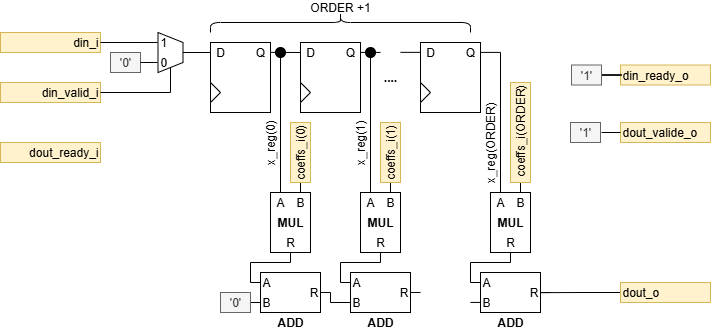
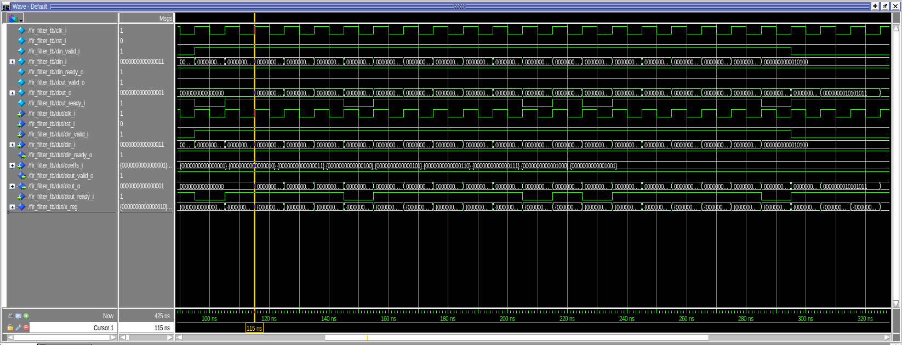
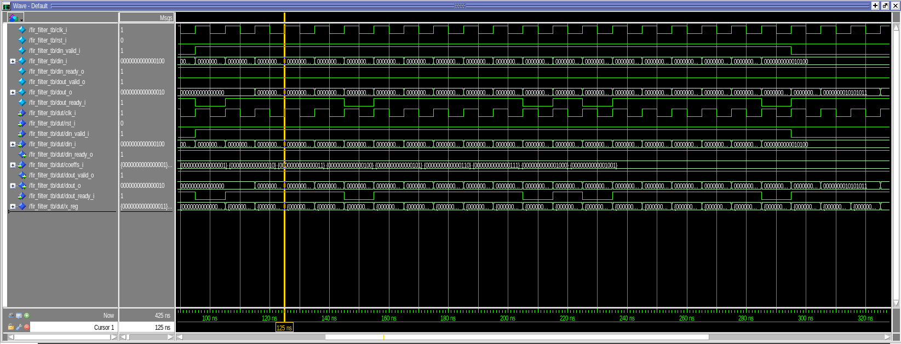
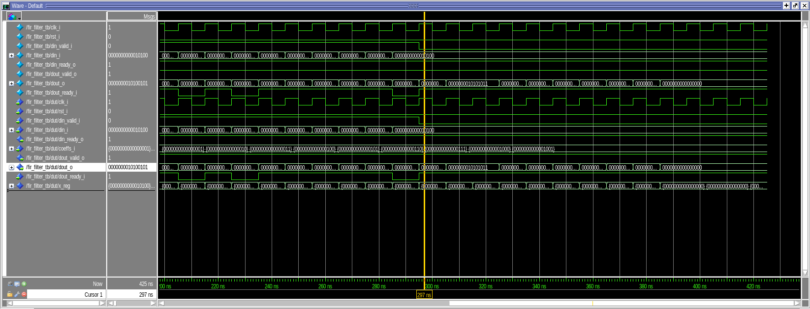
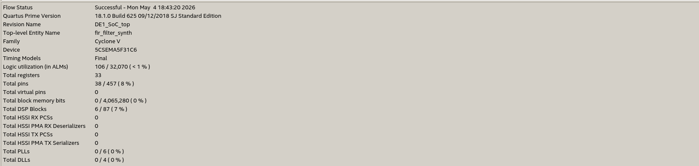
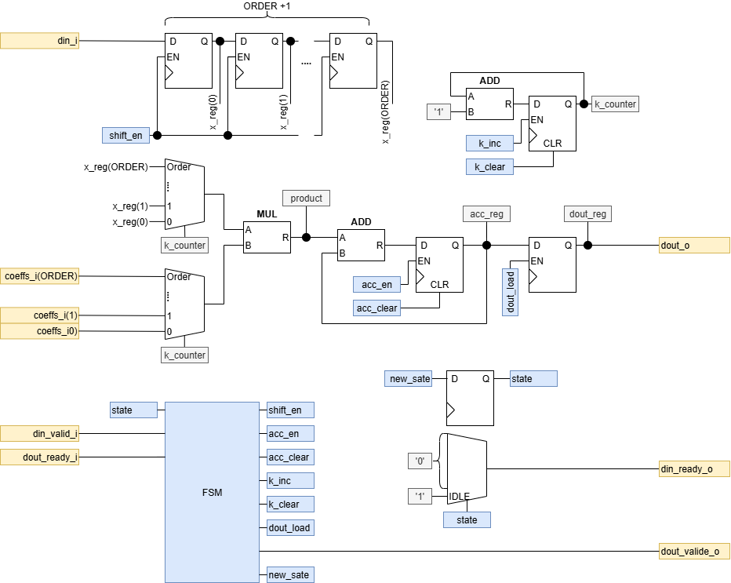
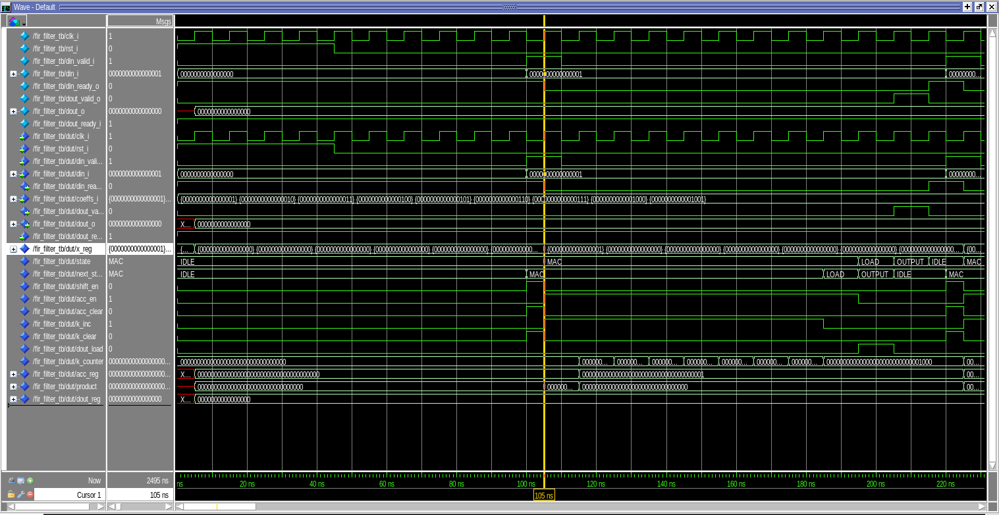
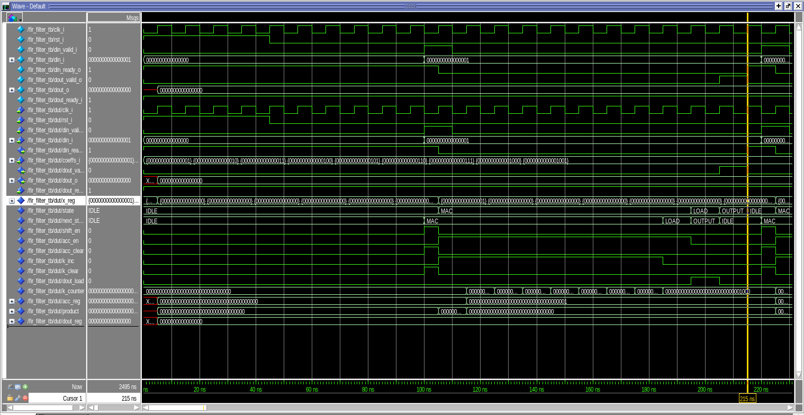
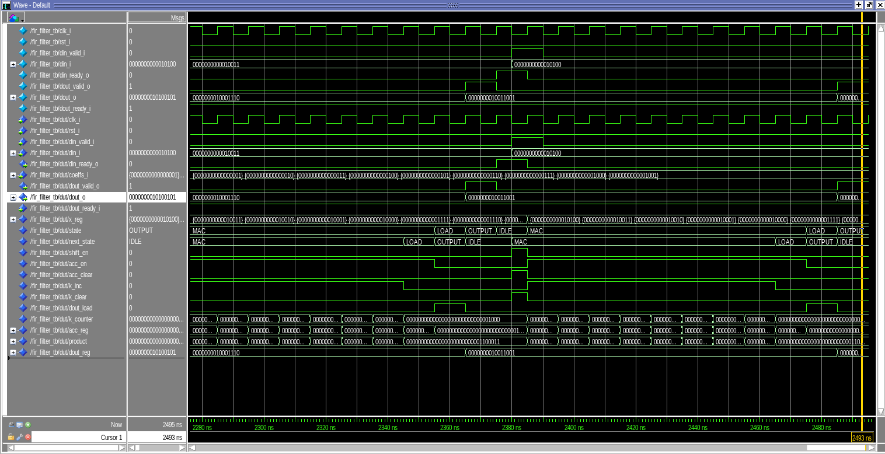
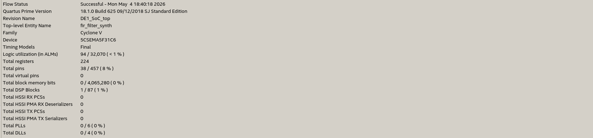

# Laboratoire n° 8

Par : Rodrigo Lopes dos Santos

Par : Urs Behrmann

\newpage

## Filtre FIR : Combinatoire

Le filtre FIR est implémenté sous forme combinatoire, avec pour objectif de maximiser le débit. Les multiplications et additions nécessaires au calcul sont réalisées en parallèle.

### Schéma



#### Chemin de données (datapath)

Les données d’entrée `din_i` sont stockées dans un registre à décalage (`x_reg`) de taille `ORDER+1`, permettant de conserver les derniers échantillons reçus.

Chaque échantillon `x_reg(k)` est multiplié en parallèle avec son coefficient associé `coeffs(k)`. Les produits obtenus sont ensuite additionnés par une chaîne d’additionneurs afin de produire directement le résultat FIR.

Le résultat final est décalé selon `COMMAPOS`, puis envoyé sur `dout_o`.

#### Unité de contrôle

Cette architecture ne nécessite pas de FSM, car le calcul est effectué directement par la logique combinatoire.

Le registre à décalage est mis à jour à chaque front montant de l’horloge. Le calcul FIR est ensuite automatiquement mis à jour en fonction du contenu de `x_reg`.

#### Interface

Dans cette version, le filtre accepte une donnée à chaque cycle :

- `din_ready_o = 1` en permanence → nouvelle donnée toujours acceptée
- `dout_valid_o = 1` en permanence → sortie toujours considérée disponible

Le signal `dout_ready_i` n’est pas utilisé dans cette architecture, car la sortie est recalculée en continu.

#### Latence & débit

La latence est très faible : elle correspond principalement au cycle nécessaire pour charger l’entrée dans le registre à décalage, puis au temps de propagation de la logique combinatoire.

Le débit est maximal :

> Débit = 1 sortie / cycle

Cette architecture privilégie donc la rapidité et le débit, au prix d’une utilisation plus importante des ressources matérielles.

#### Fréquence d'horloge

Dans l’architecture combinatoire, l’ensemble du calcul FIR (multiplications et additions) est réalisé en un seul cycle d’horloge. Le chemin critique est donc très long, car il traverse toutes les opérations arithmétiques en cascade.

La période d’horloge est alors contrainte par :

> Tclk ≥ temps(MUL) + (ORDER + 1) × temps(ADD)

Ainsi, la fréquence maximale d’horloge est relativement faible. Cette architecture privilégie le débit (une sortie par cycle), mais au détriment de la vitesse maximale de fonctionnement.

### Implémentation

L’architecture a été décrite en VHDL avec deux parties principales :

- un processus synchrone qui met à jour le registre à décalage `x_reg`,
- un processus combinatoire qui calcule la somme FIR à partir de `x_reg` et des coefficients `coeffs_i`.

Dans le processus combinatoire, une variable d’accumulation `acc_v` est utilisée pour sommer les produits :

> x_reg(k) · coeffs_i(k)

La largeur de l’accumulateur est augmentée avec la constante `ACC_W` afin de limiter les risques de dépassement pendant la somme.

Enfin, le résultat est décalé selon `COMMAPOS`, puis redimensionné sur `DATASIZE` bits pour produire `dout_o`.

### Test(s) & Validation

#### Scénario 

Le scénario envoie une donnée à chaque cycle d’horloge.

En effet, dans une architecture combinatoire, le calcul d’une sortie est instantané (un resultat par cycle). 

#### Résultats

##### Log

```bash
[PASSED] fir_filter testbench completed successfully.
```

##### Latence & Débit





Dans l’architecture combinatoire, le calcul FIR est réalisé en parallèle à partir du contenu du registre à décalage. Après le chargement d’une nouvelle donnée dans `x_reg`, la sortie `dout_o` est mise à jour par la logique combinatoire.

La latence est donc très faible : elle correspond essentiellement au cycle nécessaire pour enregistrer l’entrée, puis au temps de propagation combinatoire.

Comme le filtre peut accepter une donnée à chaque cycle (`din_ready_o = 1`) et produire une sortie à chaque cycle (`dout_valid_o = 1`), le débit est :

> Débit = 1 sortie / cycle

Cette architecture privilégie donc le débit, au prix d’une utilisation plus importante des ressources matérielles.

##### dout



La dernière valeur de sortie a été comparée à la valeur théorique attendue.  
Pour une séquence d’entrée croissante (`1 à 20`) et des coefficients `1 à 9`, la sortie correspond à la somme pondérée des 9 derniers échantillons :

> y = 1·20 + 2·19 + 3·18 + ... + 9·12 = 660

En tenant compte du facteur d’échelle (`COMMAPOS = 2`) :

> y = 660 / 4 = 165

La simulation donne la valeur binaire `0000000010100101`, soit **165 en décimal**, ce qui correspond exactement au résultat théorique.

La valeur apparaît en fin de séquence, lorsque le registre à décalage contient bien les 9 derniers échantillons nécessaires au calcul.

#### Utilisation des ressources



\newpage

## Filtre FIR : Séquentiel

Le filtre FIR est implémenté sous forme séquentielle, avec pour objectif de minimiser les ressources matérielles, en particulier en utilisant un seul multiplicateur.

### Schéma



#### Chemin de données (datapath)

Les données d’entrée din_i sont stockées dans un registre à décalage (x_reg) de taille ORDER+1, permettant de conserver les dernières valeurs reçues.

À chaque cycle, un échantillon x_reg(k) et son coefficient coeffs(k) sont sélectionnés via des multiplexeurs pilotés par un compteur k_counter. Leur produit est ensuite accumulé dans acc_reg. Après ORDER+1 cycles, le résultat est chargé dans dout_reg puis envoyé sur dout_o.

#### Unité de contrôle

Une FSM pilote le système avec quatre états :

- IDLE : attente d’une donnée
- MAC : accumulation
- LOAD : chargement du résultat
- OUTPUT : émission de la sortie

Elle génère les signaux de contrôle du datapath.

#### Interface
Le filtre utilise un protocole valid/ready :

- din_ready_o = 1 en IDLE → nouvelle donnée acceptée
- dout_valid_o = 1 en OUTPUT → sortie disponible

#### Latence & débit 

Latence = ORDER + 2 cycles

Débit ≈ 1 sortie tous les (ORDER + 2) cycles

#### Fréquence d'horloge

Dans l’architecture séquentielle, le calcul est réparti sur plusieurs cycles. À chaque cycle, une seule opération de type multiplication-accumulation (MAC) est réalisée.

Le chemin critique est donc fortement réduit et correspond uniquement à :

> Tclk ≥ temps(MUL) + temps(ADD)

Cela permet d’augmenter significativement la fréquence maximale d’horloge. En revanche, plusieurs cycles sont nécessaires pour produire une sortie, ce qui réduit le débit global.

### Implémentation

L’architecture a été décrite en VHDL en séparant le datapath et l’unité de contrôle.

Le datapath comprend :

- un registre à décalage (x_reg) pour stocker les entrées,
- un multiplicateur et un additionneur pour le calcul MAC,
- un accumulateur (acc_reg) et un registre de sortie (dout_reg),
- un compteur (k_counter) pour parcourir les coefficients.

L’implémentation est structurée en deux processus principaux :

- un processus synchrone, déclenché sur le front montant de l’horloge, qui regroupe tous les registres du datapath (registre à décalage, accumulateur, compteur, sortie) ainsi que le registre d’état,
- un processus combinatoire, décrivant la FSM, qui détermine le prochain état et génère les signaux de contrôle (shift_en, acc_en, k_inc, etc.) en fonction de l’état courant et des entrées.

L’interface suit un protocole valid/ready, assurant une gestion correcte des échanges de données avec l’environnement.

### Test(s) & Validation

#### Scénario initial 

Le scénario initial envoie une donnée à chaque cycle d’horloge.
Ce comportement n’est pas adapté à une architecture séquentielle.

En effet, dans une architecture séquentielle, le calcul d’une sortie nécessite plusieurs cycles (un cycle par opération élémentaire). 

> Par conséquent : le filtre ne peut pas produire un résultat à chaque cycle

Un envoi continu de données ne respecte donc pas le fonctionnement réel du système et peut conduire à une mauvaise interprétation des résultats.

#### Scénario adapté pour le séquentiel 

Un scénario spécifique a été mis en place pour la version séquentielle, respectant le protocole valid/ready :

- une donnée est envoyée uniquement lorsque din_ready_o = 1,
- les entrées sont appliquées avant le front d’horloge pour garantir leur prise en compte,
- les sorties sont vérifiées uniquement lorsque dout_valid_o = 1.

Les résultats attendus sont calculés à l’aide d’un modèle de référence et stockés dans une file (queue), permettant de prendre en compte la latence du filtre.

#### Résultats

##### Log

```bash
[PASSED] fir_filter testbench completed successfully.
```

##### Latence & Débit





Dans l’architecture séquentielle, le calcul FIR est effectué sur plusieurs cycles avec un seul multiplicateur. Une sortie nécessite donc plusieurs étapes : accumulation des produits, chargement du résultat, puis émission de la sortie.

La mesure entre deux retours à l’état `IDLE` donne environ 11 cycles. Cette durée inclut :

- les 9 cycles de calcul MAC (`ORDER + 1` coefficients),
- le cycle de chargement du résultat (`LOAD`),
- l’état `OUTPUT`, durant lequel la donnée est déjà disponible.

Ainsi, la latence de calcul est cohérente avec la valeur théorique :

> Latence ≈ ORDER + 2 cycles

Le débit est donc limité, car une nouvelle donnée ne peut être acceptée qu’après la fin du traitement précédent :

> Débit ≈ 1 sortie tous les (ORDER + 2) cycles

Cette architecture réduit les ressources de calcul, mais augmente la latence et diminue le débit.

##### dout

La dernière valeur de sortie a été comparée à la valeur théorique attendue.
Pour une séquence d’entrée croissante (1 à 20) et des coefficients 1 à 9, la sortie correspond à la somme pondérée des 9 derniers échantillons :

> y = 1·20 + 2·19 + 3·18 + ... + 9·12 = 660

En tenant compte du facteur d’échelle (COMMAPOS = 2) :

> y = 660 / 4 = 165



La simulation donne la valeur binaire 0000000010100101, soit 165 en décimal, ce qui correspond exactement au résultat théorique.

#### Utilisation des ressources



## Comparaison des ressources : Combinatoire VS Séquentiel
Les résultats de synthèse montrent des différences significatives entre les architectures combinatoire et séquentielle.

La version combinatoire utilise davantage de blocs de calcul, avec 6 DSP, en raison des multiplications réalisées en parallèle. Elle nécessite toutefois peu de registres (33), car peu de stockage est requis.

À l’inverse, la version séquentielle n’utilise qu’un seul DSP, grâce à la réutilisation du multiplicateur sur plusieurs cycles. Cette réduction des ressources de calcul s’accompagne d’une augmentation importante du nombre de registres (224), nécessaires pour le stockage des données, l’accumulation et le contrôle.

\newpage

## Filtre FIR : Pipeliné

### Schéma

### Implémentation

### Test(s) & Validation
